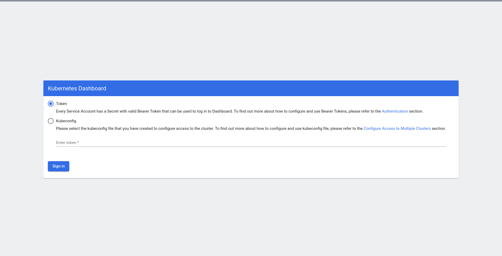
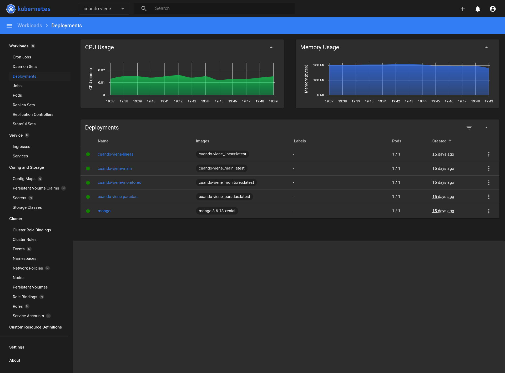

## Instalando kubenetes dashboard

Pueden instalar kubernetes dashboard desde el repo de dashoard oficial. Desde algun [release](https://github.com/kubernetes/dashboard/releases/tag/v2.4.0) se puede ver los pasos para la instalacion por default y recomendada.

Solo basta con aplicar el deploy recomendado (Nota: version usada en este ej 2.4.0)

```bash
kubectl apply -f https://raw.githubusercontent.com/kubernetes/dashboard/v2.4.0/aio/deploy/recommended.yaml
```

despues de esto puede seguir con el paso de tener un acceso seguro al dashboard del cluster

## (Opcional) Creando un usuario de admin para el dashboard de k8s

hay que crear una cuenta nueva de admin, por lo que hay que crear una cuenta y un nuevo rol:

```yaml
apiVersion: v1
kind: ServiceAccount
metadata:
  name: admin-user
  namespace: kubernetes-dashboard
---
apiVersion: rbac.authorization.k8s.io/v1
kind: ClusterRoleBinding
metadata:
  name: admin-user
roleRef:
  apiGroup: rbac.authorization.k8s.io
  kind: ClusterRole
  name: cluster-admin
subjects:
- kind: ServiceAccount
  name: admin-user
  namespace: kubernetes-dashboard
```

despues de eso basta con aplicar estos componentes en el cluster:

```bash
kubectl apply -f ./dashboard-adminuser.yml
```

una vez que tenemos el cambio aplicado, basta con obtener el token que esta asignado a nuestro admin user que hemos creado, para eso podemos hacer:

```bash
kubectl -n kubernetes-dashboard describe secret $(kubectl -n kubernetes-dashboard get secret | grep admin-user | awk '{print $1}')
```

este comando nos va a mostrar el token que necesitaremos despues para ingresar en el dashboard.

```bash
altair.λ:~/utn/iasc/iasc-kubernetes/extra(main)$ kubectl -n kubernetes-dashboard describe secret $(kubectl -n kubernetes-dashboard get secret | grep admin-user | awk '{print $1}')
Name:         admin-user-token-c8t2m
Namespace:    kubernetes-dashboard
Labels:       <none>
Annotations:  kubernetes.io/service-account.name: admin-user
              kubernetes.io/service-account.uid: 320a66b0-707d-46a7-9e9f-3b3c187dffaf

Type:  kubernetes.io/service-account-token

Data
====
token:      <REDACTED>
ca.crt:     1111 bytes
namespace:  20 bytes
```

Una vez que nos hemos copiado el token podemos seguir con exponer el servicio del dashboard a fin de acceder al mismo.

### Accediendo al dashboard

Para poder acceder al dashboard necesitamos configurar un proxy por el cual nos vamos a poder comunicar contra el dashboard y el servidor de API de k8s:

```bash
$ kubectl proxy
Starting to serve on 127.0.0.1:8001
```

Despues solo hay que entrar al [link http://localhost:8001/api/v1/namespaces/kubernetes-dashboard/services/https:kubernetes-dashboard:/proxy/](http://localhost:8001/api/v1/namespaces/kubernetes-dashboard/services/https:kubernetes-dashboard:/proxy/) para poder ingresar.

En caso de que hayamos securitizado el dashboard, tendremos que ingresar el token previamente creado:



una vez que hayamos ingresado el token correctamente podremos ver el dashboard sin problemas:

## Instalando metrics-server

Componentes tales como el HPA (HorizontalPodAutoscaler), necesitan de metricas y telemetria a fin de saber cuando deben escarlar los pods monitoreados. Uno de los servicios mas conocidos es `metrics-server`. El siguiente [link](https://github.com/kubernetes-sigs/metrics-server) lleva al repo donde se pueden ver los releases y el `yaml` que deberian aplicar a fin de instalar este servicio. Un ejemplo es el siguiente (Nota: version usada 0.5.2)

```
kubectl apply -f https://github.com/kubernetes-sigs/metrics-server/releases/download/v0.5.2/components.yaml
```

Una vez que esta instalado, podremos ver las metricas de uso de cpu y memoria ademas de tener soporte para poder usar HPA sin problemas.

